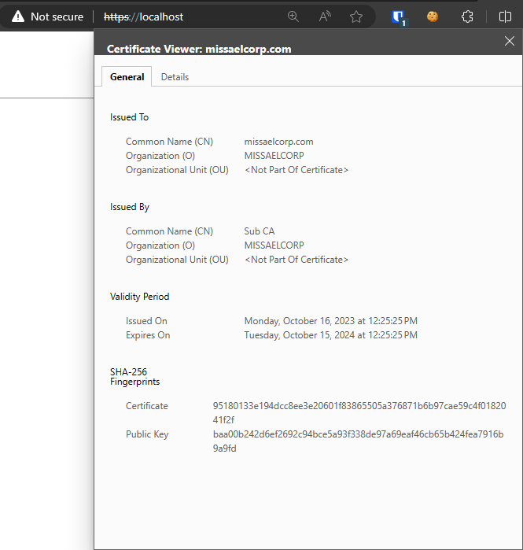
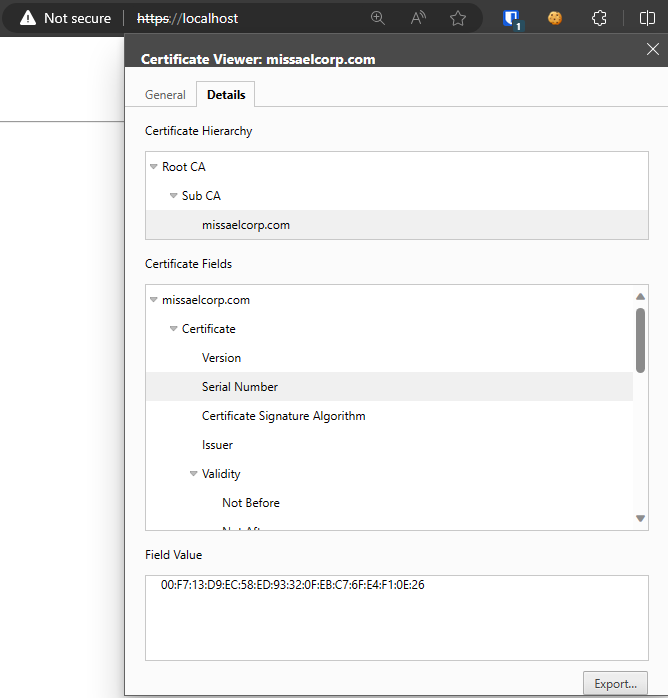

# Private Certificate Authotity

## Root CA

`root-ca.conf`:
```conf
[default]
name                    = root-ca
domain_suffix           = missaelcorp.com
aia_url                 = http://$name.$domain_suffix/$name.crt
crl_url                 = http://$name.$domain_suffix/$name.crl
ocsp_url                = http://ocsp.$name.$domain_suffix:9080
default_ca              = ca_default
name_opt                = utf8,esc_ctrl,multiline,lname,align

[ca_dn]
countryName             = "MX"
organizationName        = "MISSAELCORP"
commonName              = "Root CA"

[ca_default]
home                    = .
database                = $home/db/index
serial                  = $home/db/serial
crlnumber               = $home/db/crlnumber
certificate             = $home/$name.crt
private_key             = $home/private/$name.key
RANDFILE                = $home/private/random
new_certs_dir           = $home/certs
unique_subject          = no
copy_extensions         = none
default_days            = 3650
default_crl_days        = 365
default_md              = sha256
policy                  = policy_c_o_match

[policy_c_o_match]
countryName             = match
stateOrProvinceName     = optional
organizationName        = match
organizationalUnitName  = optional
commonName              = supplied
emailAddress            = optional

[req]
default_bits            = 4096
encrypt_key             = no
default_md              = sha256
utf8                    = yes
string_mask             = utf8only
prompt                  = no
distinguished_name      = ca_dn
req_extensions          = ca_ext

[ca_ext]
basicConstraints        = critical,CA:true
keyUsage                = critical,keyCertSign,cRLSign
subjectKeyIdentifier    = hash

[sub_ca_ext]
authorityInfoAccess     = @issuer_info
authorityKeyIdentifier  = keyid:always
basicConstraints        = critical,CA:true,pathlen:0
crlDistributionPoints   = @crl_info
extendedKeyUsage        = clientAuth,serverAuth
keyUsage                = critical,keyCertSign,cRLSign
nameConstraints         = @name_constraints
subjectKeyIdentifier    = hash

[crl_info]
URI.0                   = $crl_url

[issuer_info]
caIssuers;URI.0         = $aia_url
OCSP;URI.0              = $ocsp_url

[name_constraints]
permitted;DNS.0=missaelcorp.com
excluded;IP.0=0.0.0.0/0.0.0.0
excluded;IP.1=0:0:0:0:0:0:0:0/0:0:0:0:0:0:0:0

[ocsp_ext]
authorityKeyIdentifier  = keyid:always
basicConstraints        = critical,CA:false
extendedKeyUsage        = OCSPSigning
keyUsage                = critical,digitalSignature
subjectKeyIdentifier    = hash
```

Create the following directories and files:
```bash
mkdir root-ca
cd root-ca
mkdir certs db private
chmod 700 private
touch db/index
openssl rand -hex 16  > db/serial
echo 1001 > db/crlnumber
```

### Root CA Generation

To get the `root-ca.csr` and `root-ca.key`:
```bash
openssl req -new \
    -config root-ca.conf \
    -out root-ca.csr \
    -keyout private/root-ca.key
```

To create a self-signed certificate:
```bash
openssl ca -selfsign \
    -config root-ca.conf \
    -in root-ca.csr \
    -out root-ca.crt \
    -extensions ca_ext
```

## Sub CA

`sub-ca.conf`:
```conf
[default]
name                    = sub-ca
domain_suffix           = missaelcorp.com
aia_url                 = http://$name.$domain_suffix/$name.crt
crl_url                 = http://$name.$domain_suffix/$name.crl
ocsp_url                = http://ocsp.$name.$domain_suffix:9081
default_ca              = ca_default
name_opt                = utf8,esc_ctrl,multiline,lname,align

[ca_dn]
countryName             = "MX"
organizationName        = "MISSAELCORP"
commonName              = "Sub CA"

[ca_default]
home                    = .
database                = $home/db/index
serial                  = $home/db/serial
crlnumber               = $home/db/crlnumber
certificate             = $home/$name.crt
private_key             = $home/private/$name.key
RANDFILE                = $home/private/random
new_certs_dir           = $home/certs
unique_subject          = no
copy_extensions         = copy
default_days            = 365
default_crl_days        = 30
default_md              = sha256
policy                  = policy_c_o_match

[policy_c_o_match]
countryName             = match
stateOrProvinceName     = optional
organizationName        = match
organizationalUnitName  = optional
commonName              = supplied
emailAddress            = optional

[req]
default_bits            = 2048
encrypt_key             = no
default_md              = sha256
utf8                    = yes
string_mask             = utf8only
prompt                  = no
distinguished_name      = ca_dn

[server_ext]
authorityInfoAccess     = @issuer_info
authorityKeyIdentifier  = keyid:always
basicConstraints        = critical,CA:false
crlDistributionPoints   = @crl_info
extendedKeyUsage        = clientAuth,serverAuth
keyUsage                = critical,digitalSignature,keyEncipherment
subjectKeyIdentifier    = hash

[client_ext]
authorityInfoAccess     = @issuer_info
authorityKeyIdentifier  = keyid:always
basicConstraints        = critical,CA:false
crlDistributionPoints   = @crl_info
extendedKeyUsage        = clientAuth
keyUsage                = critical,digitalSignature
subjectKeyIdentifier    = hash

[crl_info]
URI.0                   = $crl_url

[issuer_info]
caIssuers;URI.0         = $aia_url
OCSP;URI.0              = $ocsp_url

[ocsp_ext]
authorityKeyIdentifier  = keyid:always
basicConstraints        = critical,CA:false
extendedKeyUsage        = OCSPSigning
keyUsage                = critical,digitalSignature
subjectKeyIdentifier    = hash
```

### Sub CA Generation

To get the `sub-ca.csr` and `sub-ca.key`:
```bash
openssl req -new \
    -config sub-ca.conf \
    -out sub-ca.csr \
    -keyout private/sub-ca.key
```

To create a certificate signed by our `root-ca`:
```bash
openssl ca \
    -config root-ca.conf \
    -in sub-ca.csr \
    -out sub-ca.crt \
    -extensions sub_ca_ext
```

## Server Certificate Generation

Generate an RSA Key (`server.key`) for the server
```bash
openssl genrsa -out private/server.key 2048
```

Generate the `server.csr`
```bash
openssl req -new -key private/server.key -out server.csr
```

> Note: Use the same `organizationName` for all the certificates and keep an empty password

Generate the `server.crt` signed by the `sub-ca`
```bash
openssl ca \
    -config sub-ca.conf \
    -in server.csr \
    -out server.crt \
    -extensions server_ext
```

And finally create the certificate to install to our web server
```bash
cat server.crt sub-ca.crt root-ca.crt > server-final.crt
```

## Install the Certificate to an NGINX Server using Docker

Create a `config` directory and inside an `nginx.conf`, like this:
```
./config/nginx.conf
```
And add the following:
```conf
events {}

http{
    server {
        listen 80;
        server_name missaelcorp.com;
        return 301 https://$host$request_uri;
    }

    server {
        listen 443 ssl;
        server_name missaelcorp.com;

        ssl_certificate /etc/nginx/certs/server.crt;
        ssl_certificate_key /etc/nginx/certs/server.key;

        location / {
            # Your Nginx configuration goes here
        }
    }

}
```

Then create a `docker-compose.yml` and add the following:
```yml
version: '3'
services:
  web:
    image: nginx:latest
    ports:
      - "8080:80"
      - "443:443"
    volumes:
      - ./config/nginx.conf:/etc/nginx/nginx.conf
      - ./root-ca/private/server.key:/etc/nginx/certs/server.key
      - ./root-ca/server-final.crt:/etc/nginx/certs/server.crt
```

Finally run the `docker-compose.yml`
```bash
docker compose up -d
```

Now go to [https://localhost](https://localhost) or [http://localhost:8080](http://localhost:8080) and validate the certificates.



